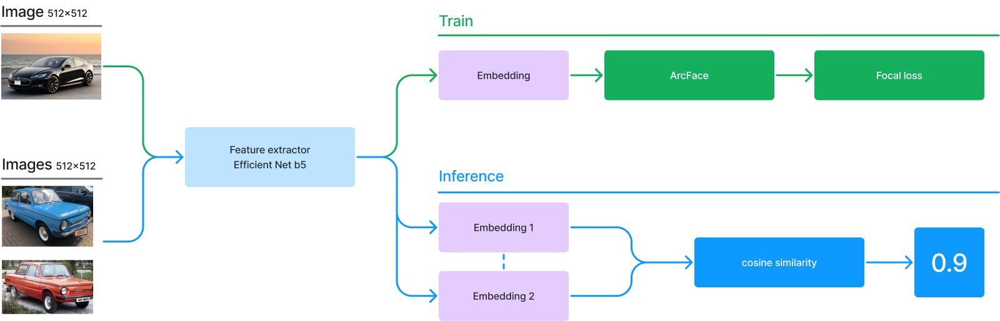

### Car Model Verification - Верификация моделей автомобилей

#### 1. Описание задачи
https://ods.ai/competitions/mcs_car_verification

Распознавание моделей машин - практически важная задача для разнообразных кейсов использования: от верификации нарушения ПДД конкретной машиной до автоматизации заполнения заявок на сайтах продажи авто или страховых компаний. Множество существующих моделей - огромно и постоянно пополняется. В такой ситуации становится непрактично тренировать и обновлять классификатор для идентификации моделей. Альтернативное решение - постановка задачи в форме верификации, где методы должны определять соответствие двух изображений машин одной и той же модели.

#### 2. Данные 
Ссылка на данные: https://disk.yandex.ru/d/3i5gKi7bI1MwZQ

Train Data Size: 175480
Val Data Size: 22156
Number of classes: 4394

#### 3. Архитектура решения

Для решения задачи использовалось:
- Efficientnet_b5 в качестве FeatureExtractor
- ArcFace на выходе из модели для решения задчи классификации
- FocalLoss
- Косинусное сходство эмбеддиногов на инференсе


#### 4. Конфигурация
Файлы с конфигурацией:
1) src/configs/train_run_cinfig.yaml - общая конфигурация запуска
2) src/configs/data_configs - конфигурации для загрузки данных
3) src/configs/model_configs - конфигурации для моделей
4) src/configs/train_configs - конфигурации для параметров обучения

Для решения используем метод ArcFace:
https://paperswithcode.com/paper/arcface-additive-angular-margin-loss-for-deep

#### 5. Запуск обучния

```angular2html
python3 src/train/train.py
```